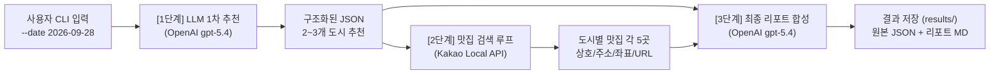

# 🗺️ 국내 여행지 추천 CLI 프로그램 (`travel_planner.py`)

> **과제명:** A1-2 Python 응용: API 활용 국내 여행지 추천 프로그램 개발  
> **개발 환경:** Python 3.10+, PowerShell, Windows  
> **핵심 기술:** LLM API (OpenAI 호환 gpt-5.4) + 지도/장소 검색 API (Kakao Local) 체이닝  

---

## 1. 프로젝트 개요

본 프로그램은 사용자가 터미널에 **여행 날짜(`--date "YYYY-MM-DD"`)**를 입력하면, **LLM API**와 **지도/장소 검색 API**를 사슬(Chain)처럼 연결하여 **국내 여행지 추천 원본 데이터(JSON)**와 **맞춤형 여행 리포트(Markdown)**를 자동으로 생성해 주는 CLI 기반 파이썬 애플리케이션입니다.

단순한 단일 API 호출을 넘어, 이기종 API(LLM + 지도) 간의 구조적 데이터 연동, 일시적 장애 복구, 캐싱 최적화, 그리고 복수 지역 확장까지 고려하여 완성도 높게 구현되었습니다.



---

## 2. 주요 기능 및 특징

1. **CLI 기반 직관적인 인터페이스 (`argparse`)**
   - 여행 날짜 입력값 검증(`YYYY-MM-DD` 형식 불일치 시 친절한 사용법 출력 후 즉시 종료).
   - 단계별 진행 로그(1/3 ➔ 2/3 ➔ 3/3) 및 최종 저장 파일 경로 화면 출력.
2. **복수 지역(2~3곳) 기본 추천 (보너스 과제 1 규칙 준수)**
   - 한 번의 실행으로 여행 시기에 적합한 국내 여행지 2~3곳(`recommended_cities`)을 동시 추천.
   - 각 지역별로 카카오 로컬 API를 순회(루프) 조회하여 총 10~15곳의 실제 맛집 정보 수집.
   - 필요 시 단일 지역만 추천받을 수 있는 `--single` 옵션 지원.
3. **동일 날짜 작업 번호(`_1`, `_2`...) 자동 채번 시스템**
   - 동일한 날짜로 프로그램을 여러 번 실행해도 이전 결과물을 덮어쓰지 않고, 자동으로 작업 번호 접미사(`2026-09-28_1`, `2026-09-28_2`...)를 채번하여 각각 독립적으로 저장 및 보존.
   - 특정 작업 회차를 지정하여 실행하거나 관리할 수 있는 `--job` 인자 지원.
4. **고속 결과 캐싱 (보너스 과제 2 규칙 준수)**
   - 동일 날짜로 재실행 시, 저장된 원본 JSON이 존재하면 외부 API 호출을 건너뛰고 기존 데이터로부터 초고속으로 리포트만 재생성(`--cache`).
   - 이전 실행의 일시적 리포트 생성 오류 로그를 자동 정제(Sanitize)하여 깨끗한 리포트 복원.
5. **견고한 예외 처리 및 장애 복구 (Fault-Tolerant)**
   - **지수 백오프(Exponential Backoff) 재시도:** API 서버 과부하(HTTP 429, 500, 502, 503, 504) 및 네트워크 불안정 시 2초, 4초, 6초 대기 후 최대 3회 자동 재시도.
   - **JSON 파싱 자가 복구:** LLM 응답이 올바른 JSON이 아닐 경우 프롬프트를 보정하여 1회 자동 재시도.
   - **지도 API 무중단 처리:** 카카오 API 인증 실패(401/403) 또는 검색 결과 0건 발생 시 프로그램을 중단하지 않고 "데이터 없음" 처리 후 리포트 작성 지속.
   - **로컬 폴백 템플릿:** 리포트 생성 LLM 호출이 끝내 실패할 경우 내장 템플릿(`build_fallback_report`)으로 대체하여 빈 파일 생성을 방지.
6. **철저한 보안 관리**
   - API 키를 코드나 Git 커밋에 절대 하드코딩하지 않고 `.env` 파일로 완전 분리.

---

## 3. 기술 스택 및 사용 API

| 구분 | 기술 / 서비스 | 버전 / 엔드포인트 | 비고 |
| :--- | :--- | :--- | :--- |
| **LLM API** | OpenAI 호환 API | `gpt-5.4` (`https://copa.codyssey.kr/v1/chat/completions`) | 빠르고 정확한 JSON 구조화 출력 및 고품질 한국어 리포트 생성, 코디세이 플랫폼 제공 API |
| **지도 API** | Kakao Local Search API | `https://dapi.kakao.com/v2/local/search/keyword.json` | 도로명 주소, 카테고리, 좌표, 카카오맵 상세 링크 제공 |
| **환경변수** | `python-dotenv` | 최신 | `.env` 파일의 비밀 키를 `os.getenv`로 안전하게 로드 |
| **HTTP 통신** | `requests` | 최신 | REST API 호출 및 타임아웃, 상태 코드 핸들링 |
| **CLI 처리** | `argparse` | Python 내장 | CLI 옵션 파싱 및 표준 도움말 제공 |

---

## 4. 설치 및 개발 환경 구축

### 4-1. 가상환경 생성 및 활성화

터미널(PowerShell)을 열고 `travel-planner/` 디렉터리로 이동한 후 실행합니다:

```powershell
# 1. travel-planner 폴더로 이동
cd C:\test7\2단계_개인과제\A1-2\travel-planner

# 2. 가상환경 생성 (최초 1회)
python -m venv venv

# 3. 가상환경 활성화
.\venv\Scripts\Activate.ps1
# (활성화 성공 시 터미널 프롬프트 앞에 (venv) 가 표시됩니다)
```

> **스크립트 실행 오류 시:** PowerShell에서 실행 권한 오류(`Execution_Policies`)가 발생할 경우 아래 명령어를 입력하고 활성화를 다시 시도하세요:
> ```powershell
> Set-ExecutionPolicy -ExecutionPolicy RemoteSigned -Scope Process
> ```

### 4-2. 필수 라이브러리 설치

```powershell
pip install requests python-dotenv
```

또는 `requirements.txt`를 활용하여 일괄 설치합니다:

```powershell
pip install -r requirements.txt
```

---

## 5. API 키 설정 방법

프로젝트 루트(`travel-planner/`) 폴더에 `.env` 파일을 생성하고 아래와 같이 키를 설정합니다.

### `.env` 파일 설정 예시 (절대 실제 키를 외부에 노출하지 마세요)

```ini
# OpenAI 호환 API 가상 키
OPENAI_API_KEY=your_openai_virtual_key_here

# Kakao Developers REST API 키
KAKAO_REST_API_KEY=your_kakao_rest_api_key_here
```

### 키 발급 안내
1. **OPENAI_API_KEY:** Codyssey
2. **KAKAO_REST_API_KEY:** [카카오 개발자 센터](https://developers.kakao.com) 로그인 ➔ 내 애플리케이션 추가 ➔ **REST API 키** 복사 ➔ `[플랫폼] ➔ Web 플랫폼 등록` 필수.

---

## 6. 실행 방법 및 명령어 옵션

가상환경이 활성화된 상태(`(venv)`)에서 아래 명령어를 실행합니다.

### 6-1. 기본 실행 (복수 지역 2~3곳 추천)
동일한 날짜의 기존 파일이 있으면 자동으로 작업 번호(`_1`, `_2`...)가 붙어 별도 생성됩니다:

```powershell
python travel_planner.py --date "2026-09-28"
```

### 6-2. 특정 작업 번호 지정 실행
원하는 작업 번호(예: `1`)를 직접 부여하여 실행할 수 있습니다:

```powershell
python travel_planner.py --date "2026-09-28" --job 1
```

### 6-3. 결과 캐싱을 활용한 초고속 리포트 재생성 (보너스 과제 2)
이미 저장된 원본 JSON 데이터가 있을 때, 외부 API 호출을 건너뛰고 리포트만 고속으로 다시 생성합니다:

```powershell
python travel_planner.py --date "2026-09-28" --cache
```

### 6-4. 캐시 무시 및 강제 새로 호출
기존 캐시가 있어도 이를 무시하고 외부 API를 새로 호출합니다:

```powershell
python travel_planner.py --date "2026-09-28" --no-cache
```

### 6-5. 단일 지역 추천 모드
복수 지역이 아닌 단 1곳의 도시만 추천받고 싶을 때 사용합니다:

```powershell
python travel_planner.py --date "2026-09-28" --single
```

---

## 7. 결과물 확인 방법

프로그램이 성공적으로 실행되면 `results/` 폴더 아래에 2개의 파일이 생성됩니다.

```
travel-planner/
└── results/
    ├── {날짜}_{작업번호}_raw.json          ← 원본 데이터 (1차 추천 + 맛집 목록 + 오류 목록)
    └── {날짜}_{작업번호}_travel_plan.md    ← 최종 Markdown 여행 리포트
```

### 1) 원본 데이터 JSON (`_raw.json`) 구조
```json
{
  "date": "2026-09-28",
  "tag": "2026-09-28_1",
  "multi": true,
  "recommendation": {
    "recommended_cities": ["안동", "전주", "강릉"],
    "recommended_city": "안동",
    "weather": "초가을 쾌적하고 일교차가 큰 날씨...",
    "events": ["안동국제탈춤페스티벌 (안동)", "전주비빔밥축제 (전주)", "강릉커피축제 (강릉)"],
    "reason": "전통문화와 가을꽃, 바다가 어우러진..."
  },
  "restaurants": {
    "안동": [
      {
        "name": "아차가",
        "address": "경북 안동시 문화광장길 40-5",
        "category": "음식점 > 카페",
        "url": "http://place.map.kakao.com/501790577",
        "lng": 128.73128775015536,
        "lat": 36.56492026553032
      }
    ],
    "전주": [ ... ],
    "강릉": [ ... ]
  },
  "errors": []
}
```

### 2) 최종 여행 리포트 (`_travel_plan.md`) 주요 항목
1. **여행 한눈에 보기 / 추천 지역:** 추천 도시 목록 명시
2. **추천 이유 요약:** 도시별 가을 시즌 매력 포인트
3. **날씨 요약 및 복장 조언:** 낮/밤 기온차 안내 및 추천 복장
4. **행사/축제 목록:** 해당 날짜에 부합하는 실제 축제명 및 지역 매핑
5. **지역별 맛집 리스트:** 지역별 소제목(`### 도시명`)으로 구분된 상호, 카테고리, 도로명 주소, 카카오맵 바로가기 링크 표
6. **1일 일정 제안:** 메인 추천 도시의 오전/점심/오후/저녁 추천 동선 및 연계 코스 팁
6. **오류 요약:** 오류 내역 (정상 시 "없음")

---

## 8. 에러 처리 정책

| 오류 상황 | 대응 정책 | 결과 리포트 반영 |
| :--- | :--- | :--- |
| **API 키 미설정** | 프로그램 즉시 종료 (`sys.exit(1)`) 및 `.env` 설정 방법 안내 문구 화면 출력 | 파일 생성 안 됨 |
| **날짜 형식 오류** | 사용법(`--date "YYYY-MM-DD"`) 출력 후 즉시 종료 | 파일 생성 안 됨 |
| **일시적 서버 오류 (429/500/503)** | 2초, 4초, 6초 지수 백오프 대기 후 최대 3회 자동 재시도 | 정상 복구 시 오류 없음 기록 |
| **LLM JSON 파싱 실패** | `build_retry_prompt`를 적용하여 1회 자동 재시도 (최대 1회 제한) | 재시도 후에도 실패 시 `errors`에 기록 |
| **지도 API 인증 실패 (401/403)** | 화면에 경고 로그 출력 후 맛집 섹션을 "데이터 없음" 처리하고 파이프라인 지속 | `errors`에 원인 기록, 리포트는 정상 완성 |
| **맛집 검색 결과 0건** | 키워드 변경 재시도 없이 "데이터 없음" 처리 후 리포트 지속 | `errors`에 0건 사유 기록, 리포트 완성 |
| **리포트 생성 최종 실패** | 내장된 `build_fallback_report()` 함수로 즉시 대체 전환 | 로컬 템플릿 리포트 정상 생성 보장 |

---

## 9. 보안 주의사항 (API Key Protection)

> [!CAUTION]
> **API 키는 절대 공개 저장소나 외부에 유출되어서는 안 됩니다.**

1. **코드 내 하드코딩 금지:** 모든 비밀 키는 코드에 직접 적지 않고 `.env` 파일에서만 불러옵니다.
2. **`.gitignore` 설정 필수:** Git 저장소에 커밋하기 전, `.gitignore` 파일에 `.env`와 `venv/`가 반드시 포함되어 있는지 확인하세요:
   ```text
   .env
   venv/
   __pycache__/
   ```
3. **문서 및 리포트 내 마스킹:** README, 실행 로그, 결과 마크다운 리포트에 실제 키 값이 출력되거나 기록되지 않도록 철저히 관리됩니다.
